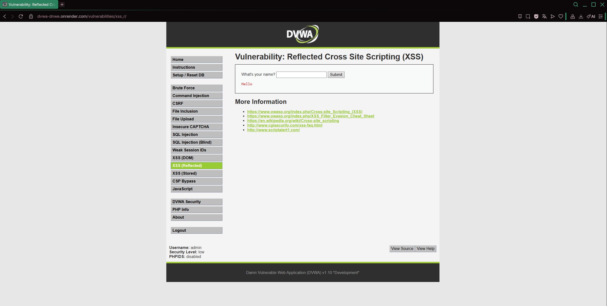

# Ataque 2 — XSS Reflected (Cross-Site Scripting Reflejado)

**Empresa auditada:** E22 — EnergíaViva  
**Módulo DVWA:** XSS (Reflected)  
**Nivel de seguridad:** Low  
**URL del ataque:** https://dvwa-dnwe.onrender.com/vulnerabilities/xss_r/

---

## 1. Evidencia del Ataque

### Payload utilizado
```html
<script>alert('XSS')</script>
```

### Captura del ataque



### Resultado obtenido

Al ingresar el payload en el campo "What's your name?", el navegador ejecutó el código JavaScript inyectado, mostrando un cuadro de alerta con el texto `XSS`. Esto demuestra que el servidor devuelve el input del usuario directamente en la respuesta HTML **sin sanitización**, ejecutando el script en el contexto del navegador de la víctima.

En el contexto de **EnergíaViva**, un atacante podría enviar a clientes un enlace malicioso que, al abrirlo, ejecute scripts para robar cookies de sesión, redirigir a páginas falsas de pago o capturar credenciales del portal.

---

## 2. Por Qué Funciona la Vulnerabilidad

### Explicación técnica

La vulnerabilidad XSS Reflected ocurre cuando la aplicación **refleja** el input del usuario en la respuesta HTML sin codificarlo. El flujo del ataque es:

1. El atacante construye una URL maliciosa con el payload en el parámetro:
   ```
   https://dvwa-dnwe.onrender.com/vulnerabilities/xss_r/?name=<script>alert('XSS')</script>
   ```
2. La víctima recibe esta URL (por correo, SMS o redes sociales) y la abre.
3. El servidor incluye el valor del parámetro `name` directamente en el HTML:
   ```html
   <!-- Código vulnerable (PHP) -->
   echo '<pre>Hello ' . $_GET['name'] . '</pre>';
   ```
4. El navegador interpreta `<script>alert('XSS')</script>` como código HTML/JS legítimo y lo ejecuta.

### Raíz del problema

- Ausencia de codificación de output (HTML encoding)
- Falta de política CSP (Content Security Policy)
- No se valida ni filtra el input recibido por parámetros GET/POST
- El ataque se propaga mediante URLs compartidas (sin persistencia en BD)

---

## 3. Puntaje y Severidad CVSS 3.1

| Métrica | Valor | Justificación |
|--------|-------|---------------|
| Vector de ataque (AV) | Network (N) | Explotable remotamente vía URL |
| Complejidad (AC) | Low (L) | Solo requiere que la víctima abra un enlace |
| Privilegios requeridos (PR) | None (N) | No requiere autenticación |
| Interacción de usuario (UI) | Required (R) | Víctima debe abrir el enlace malicioso |
| Alcance (S) | Changed (C) | Afecta el navegador de la víctima (fuera del servidor) |
| Confidencialidad (C) | Low (L) | Robo de cookies/sesiones individuales |
| Integridad (I) | Low (L) | Puede modificar contenido visual de la página |
| Disponibilidad (A) | None (N) | No afecta disponibilidad directamente |

**Vector CVSS:** `CVSS:3.1/AV:N/AC:L/PR:N/UI:R/S:C/C:L/I:L/A:N`  
**Puntuación Base:** **6.1 — MEDIA**

> Calculado con: https://www.first.org/cvss/calculator/3.1

### Impacto específico en EnergíaViva

- **Phishing de clientes:** Un atacante puede enviar un enlace al portal real de EnergíaViva que robe las credenciales del cliente al ingresar.
- **Secuestro de sesión:** Robo del cookie de sesión para operar como el cliente (pagar facturas, cambiar datos bancarios).
- **Ingeniería social:** Redirigir al cliente a una página falsa de pago de cuentas de luz, capturando tarjetas de crédito.
- **Daño reputacional:** Si se distribuye masivamente, puede afectar la confianza en el portal de un servicio esencial.

---

## 4. Política de Prevención (3.1.4)

**Política:** *Codificación Segura de Output en Aplicaciones Web de EnergíaViva*

- **Alcance:** Todos los formularios y parámetros de entrada del portal de clientes y sistemas internos.
- **Obligación:** Todo dato proveniente del usuario debe ser codificado antes de ser incluido en respuestas HTML, JavaScript, CSS o URLs.
- **Estándar aplicable:** OWASP Top 10 — A03:2021 Injection; OWASP XSS Prevention Cheat Sheet.
- **Responsable:** Equipo de Desarrollo y Seguridad de la Información.
- **Revisión:** Semestral.

---

## 5. Control de Mitigación (3.1.5)

### Corrección técnica inmediata

**Usar htmlspecialchars() para codificar el output (PHP):**

```php
// Código seguro
echo '<pre>Hello ' . htmlspecialchars($_GET['name'], ENT_QUOTES, 'UTF-8') . '</pre>';
```

Esto convierte `<script>` en `&lt;script&gt;`, que el navegador muestra como texto plano en lugar de ejecutarlo.

### Controles adicionales

| Control | Descripción | Prioridad |
|---------|-------------|-----------|
| Content Security Policy (CSP) | Cabecera HTTP que restringe la ejecución de scripts no autorizados | Alta |
| Validación de input | Rechazar o sanitizar caracteres `<`, `>`, `"`, `'`, `&` en inputs | Alta |
| HttpOnly en cookies | Impedir acceso a cookies de sesión desde JavaScript | Alta |
| Librería de sanitización | Usar DOMPurify (frontend) o HTMLPurifier (backend) | Media |
| Capacitación en OWASP | Formar a desarrolladores en codificación segura | Media |

---

*Este ataque fue realizado exclusivamente en el entorno controlado DVWA, autorizado para fines educativos.*
