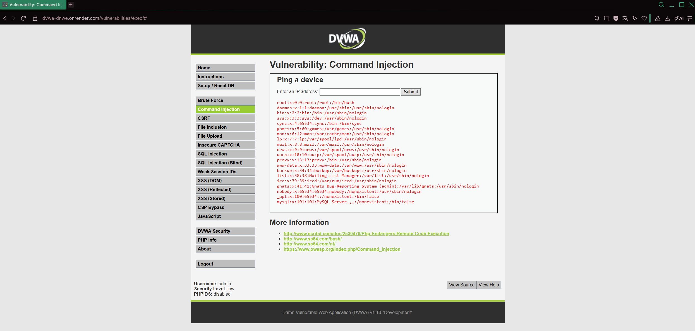

# Ataque 3 — Inyección de Comandos (Command Injection)

**Empresa auditada:** E22 — EnergíaViva  
**Módulo DVWA:** Command Injection  
**Nivel de seguridad:** Low  
**URL del ataque:** https://dvwa-dnwe.onrender.com/vulnerabilities/exec/

---

## 1. Evidencia del Ataque

### Payload utilizado
```
127.0.0.1; cat /etc/passwd
```

### Captura del ataque



### Resultado obtenido

Al ingresar el payload en el campo de dirección IP, la aplicación ejecutó el comando `ping 127.0.0.1` y luego, debido al operador `;`, ejecutó `cat /etc/passwd`, mostrando el **archivo de usuarios del sistema operativo del servidor**. Este archivo reveló cuentas del sistema, rutas de directorios y servicios corriendo en el servidor (MySQL, Apache, etc.).

En el contexto de **EnergíaViva**, esto significa que un atacante tiene **acceso directo al sistema operativo del servidor** que aloja el portal de clientes, pudiendo ejecutar cualquier comando con los privilegios del proceso web.

---

## 2. Por Qué Funciona la Vulnerabilidad

### Explicación técnica

La vulnerabilidad existe porque la aplicación pasa el input del usuario **directamente a una función de ejecución de comandos del sistema operativo** sin sanitización:

```php
// Código vulnerable (PHP)
$target = $_REQUEST['ip'];
$cmd = shell_exec('ping -c 4 ' . $target);
echo '<pre>' . $cmd . '</pre>';
```

Al ingresar `127.0.0.1; cat /etc/passwd`, el sistema ejecuta:

```bash
ping -c 4 127.0.0.1; cat /etc/passwd
```

El operador `;` en bash separa comandos, por lo que ambos se ejecutan secuencialmente. El servidor devuelve la salida de ambos comandos en la respuesta HTTP.

### Otros payloads posibles

```bash
127.0.0.1 && ls -la          # Listar archivos del servidor
127.0.0.1 | whoami           # Identificar usuario del proceso
127.0.0.1 & rm -rf /var/www  # Eliminar archivos del sitio web (destructivo)
```

### Raíz del problema

- Uso de `shell_exec()`, `exec()` o `system()` con input no sanitizado
- Ausencia de lista blanca para el formato de IP (solo dígitos y puntos)
- Proceso web ejecutándose con privilegios excesivos
- Sin contenerización ni separación de ambientes

---

## 3. Puntaje y Severidad CVSS 3.1

| Métrica | Valor | Justificación |
|--------|-------|---------------|
| Vector de ataque (AV) | Network (N) | Explotable remotamente vía internet |
| Complejidad (AC) | Low (L) | No requiere condiciones especiales |
| Privilegios requeridos (PR) | None (N) | No requiere autenticación previa |
| Interacción de usuario (UI) | None (N) | El atacante actúa solo |
| Alcance (S) | Changed (C) | Afecta el sistema operativo (fuera de la app) |
| Confidencialidad (C) | High (H) | Acceso total al sistema de archivos del servidor |
| Integridad (I) | High (H) | Puede modificar, crear o eliminar cualquier archivo |
| Disponibilidad (A) | High (H) | Puede detener servicios o eliminar datos |

**Vector CVSS:** `CVSS:3.1/AV:N/AC:L/PR:N/UI:N/S:C/C:H/I:H/A:H`  
**Puntuación Base:** **10.0 — CRÍTICA**

> Calculado con: https://www.first.org/cvss/calculator/3.1

### Impacto específico en EnergíaViva

Esta es la vulnerabilidad más grave identificada. En EnergíaViva, un atacante con RCE (Remote Code Execution) podría:

- **Exfiltrar la base de datos completa** de clientes, consumos y pagos
- **Instalar un ransomware** que cifre los datos de facturación, paralizando el servicio de cobro
- **Modificar registros de consumo** para beneficiar a clientes o dañar la facturación
- **Moverse lateralmente** hacia otros sistemas internos (SCADA, sistemas de medición remota)
- **Comprometer infraestructura crítica** si el servidor tiene acceso a redes operacionales
- Constituye una violación grave ante la SEC y la Ley 21.459

---

## 4. Política de Prevención (3.1.4)

**Política:** *Prohibición del Uso de Funciones de Ejecución de Comandos del Sistema con Input de Usuario*

- **Alcance:** Todos los sistemas y aplicaciones web del portal de clientes EnergíaViva y sistemas internos.
- **Obligación:** Queda prohibido el uso de `shell_exec()`, `exec()`, `system()`, `passthru()` o equivalentes con input de usuario no validado. Si es estrictamente necesario ejecutar comandos del sistema, debe aplicarse lista blanca estricta.
- **Estándar aplicable:** OWASP Top 10 — A03:2021 Injection; NIST SP 800-53 SI-10.
- **Responsable:** Jefatura de Ciberseguridad y Desarrollo.
- **Revisión:** Semestral con auditoría de código obligatoria.

---

## 5. Control de Mitigación (3.1.5)

### Corrección técnica inmediata

**Opción 1 — Validación con lista blanca (Regex):**

```php
// Código seguro: solo permite formato de IP válida
$target = $_REQUEST['ip'];
if (!preg_match('/^\d{1,3}\.\d{1,3}\.\d{1,3}\.\d{1,3}$/', $target)) {
    die('IP inválida');
}
$cmd = shell_exec('ping -c 4 ' . escapeshellarg($target));
echo '<pre>' . htmlspecialchars($cmd) . '</pre>';
```

**Opción 2 — Usar funciones nativas de PHP (sin shell):**

```php
// Mejor alternativa: no invocar shell en absoluto
// Usar librerías PHP para operaciones de red en lugar de comandos del SO
```

### Controles adicionales

| Control | Descripción | Prioridad |
|---------|-------------|-----------|
| Principio de mínimo privilegio | El proceso web no debe ejecutarse como root | Crítica |
| Contenerización (Docker) | Aislar la aplicación web del sistema operativo base | Alta |
| WAF con reglas de Command Injection | Detectar y bloquear operadores `;`, `|`, `&&`, `&` | Alta |
| Monitoreo de procesos | Alertar si el proceso web genera procesos hijo no esperados | Alta |
| Revisión de código (SAST) | Análisis estático del código antes de desplegar | Media |

---

*Este ataque fue realizado exclusivamente en el entorno controlado DVWA, autorizado para fines educativos.*
